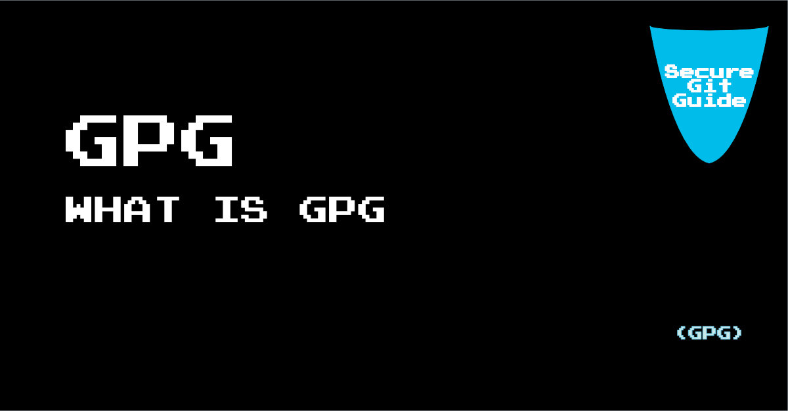

# GPG - What is GPG

Note: Source [WIKIPEDIA](https://en.wikipedia.org/wiki/GNU_Privacy_Guard)

---

## Brief Summary

GNU Privacy Guard (GnuPG or GPG) is a free-software replacement for Symantec's PGP cryptographic software suite. The software is compliant with RFC 4880, the IETF standards-track specification of OpenPGP. Modern versions of PGP are interoperable with GnuPG and other OpenPGP-compliant systems.

## Overview

GnuPG is a hybrid-encryption software program because it uses a combination of conventional symmetric-key cryptography for speed, and public-key cryptography for ease of secure key exchange, typically by using the recipient's public key to encrypt a session key which is used only once. This mode of operation is part of the OpenPGP standard and has been part of PGP from its first version.

The GnuPG 1.x series uses an integrated cryptographic library, while the GnuPG 2.x series replaces this with Libgcrypt.

GnuPG encrypts messages using asymmetric key pairs individually generated by GnuPG users. The resulting public keys may be exchanged with other users in a variety of ways, such as Internet key servers. They must always be exchanged carefully to prevent identity spoofing by corrupting public key ↔ "owner" identity correspondences. It is also possible to add a cryptographic digital signature to a message, so the message integrity and sender can be verified, if a particular correspondence relied upon has not been corrupted.

GnuPG also supports symmetric encryption algorithms. By default, GnuPG uses the AES symmetrical algorithm since version 2.1, CAST5 was used in earlier versions. GnuPG does not use patented or otherwise restricted software or algorithms. Instead, GnuPG uses a variety of other, non-patented algorithms.

For a long time, it did not support the IDEA encryption algorithm used in PGP. It was in fact possible to use IDEA in GnuPG by downloading a plugin for it, however, this might require a license for some uses in countries in which IDEA was patented. Starting with versions 1.4.13 and 2.0.20, GnuPG supports IDEA because the last patent of IDEA expired in 2012. Support of IDEA is intended "to get rid of all the questions from folks either trying to decrypt old data or migrating keys from PGP to GnuPG", and hence is not recommended for regular use.

As of 2.2 versions, GnuPG supports the following algorithms:

### Public key

RSA, ElGamal, DSA, ECDH, ECDSA, EdDSA

### Cipher

3DES, IDEA (since versions 1.4.13 and 2.0.20), CAST5, Blowfish, Twofish, AES-128, AES-192, AES-256, Camellia-128, -192 and -256 (since versions 1.4.10 and 2.0.12)

### Hash

MD5, SHA-1, RIPEMD-160, SHA-256, SHA-384, SHA-512, SHA-224

### Compression

Uncompressed, ZIP, ZLIB, BZIP2

More recent releases of GnuPG 2.x ("modern" and the now deprecated "stable" series) expose most cryptographic functions and algorithms Libgcrypt (its cryptography library) provides, including support for elliptic curve cryptography (ECDH, ECDSA and EdDSA) in the "modern" series (i.e. since GnuPG 2.1).

---

Note: Source [WIKIPEDIA](https://en.wikipedia.org/wiki/GNU_Privacy_Guard)
  
[Back to home](./index.md)
